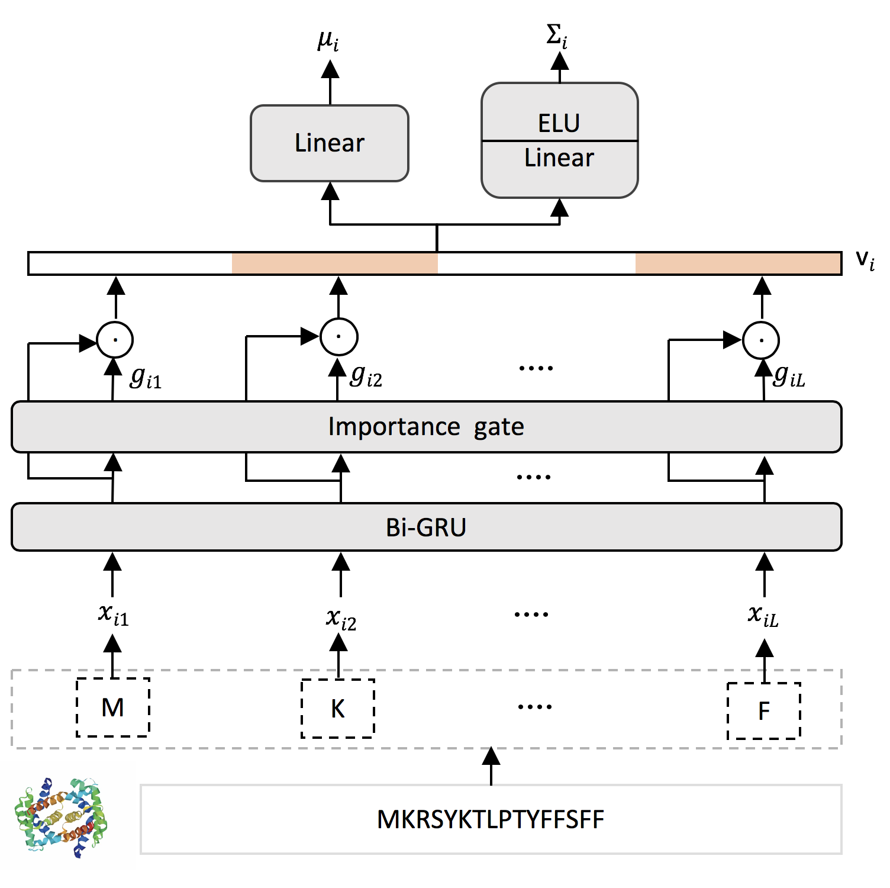

# Interpretable Sparse Gaussian Embedding for Protein-Protein Interaction Prediction
This is the pytorch implementation of the Protein2Gauss as described in our paper.

## Architecture of Protein2Gauss


Requirements 
* PyTorch
* python3.6
* sklearn
* scipy

### Example to run demo.
```
python example.py
```
